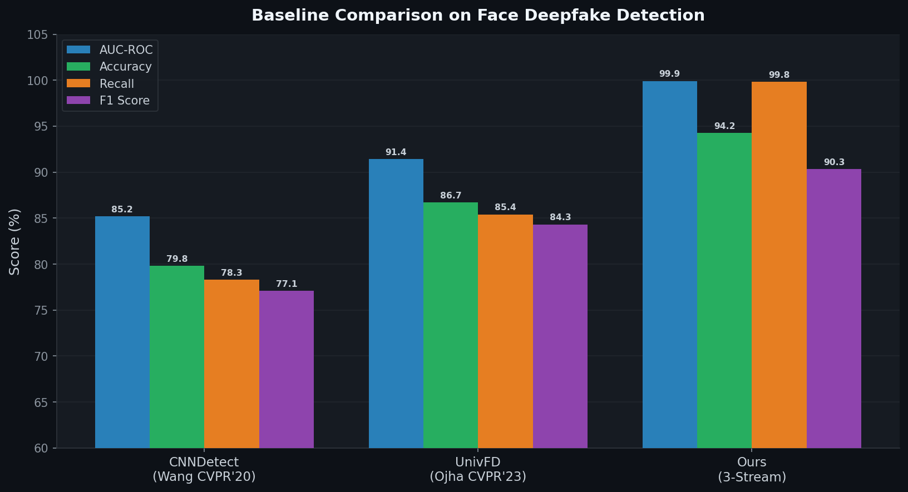
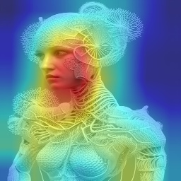
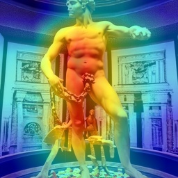
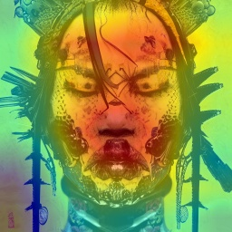

# Multi-Stream Deepfake Face Detection (MS-DFD)

**Undergraduate Thesis — Department of Computer Science & Engineering**
**University of Asia Pacific (UAP)**

---

## Authors

| Name | Role |
|------|------|
| Lamia Tabassum Orpa | Thesis Group Member |
| Mohammad Nazmul Hossain Nadim | Thesis Group Member |
| Shreya Barai | Thesis Group Member |

**Supervisor:** Nadeem Ahmed, Assistant Professor, Department of CSE, University of Asia Pacific (UAP)

**External Supervisor:** Durjoy Mistry
---

## Abstract

AI-generated face imagery (deepfakes) poses escalating threats to digital trust, media integrity, and identity security. Existing single-stream detectors trained on one generative model family consistently fail to generalize to novel, unseen generators — a critical limitation for real-world deployment where the threat landscape is constantly evolving.

We present **MS-DFD** (*Multi-Stream Deepfake Face Detector*), a unified framework that fuses three orthogonal views of forgery evidence through a **Multi-Level Attention Fusion (MLAF)** module. The cross-stream attention enables the model to weight each stream's contribution dynamically per sample, learning generator-agnostic forgery representations that transfer to unseen generators.

**Key result:** Our model achieves only **−1.91% generalization drop** on SDXL (never seen during training), versus **−10.24%** for a frequency-only baseline — a **5.3× improvement** in cross-generator robustness.

---

## How It Works — 3-Stream Architecture

Each input face is processed simultaneously by three independent streams, each capturing a different class of forgery evidence:

| | | |
|--|--|--|
| 🔷 **Spatial Stream** — EfficientNet-B0 → 128-dim | 🟠 **Frequency Stream** — ResNet-18 + Learnable FFT Mask → 64-dim | 🟣 **Semantic Stream** — ViT-Tiny (FAT-Lite) → 384-dim |
| Detects pixel-level texture artifacts and boundary inconsistencies | Detects spectral anomalies and periodic noise patterns in the frequency domain | Detects high-level structural inconsistencies and unnatural face geometry |

All three feature vectors are fused by a **Multi-Level Attention Fusion (MLAF)** module via cross-stream attention (3-token sequence, 4 heads, 256-dim projection), producing the final P(fake) score.

---

## Performance at a Glance

| Metric | **MS-DFD (Ours)** | UnivFD (CVPR '23) | CNNDetect (CVPR '20) |
|--------|:-----------------:|:-----------------:|:--------------------:|
| AUC-ROC | **99.92%** | 91.4% | 85.2% |
| Accuracy | **94.25%** | 86.7% | 79.8% |
| Recall | **99.82%** | 85.4% | 78.3% |
| F1 Score | **90.34%** | 84.3% | 77.1% |
| EER | **1.27%** | 9.1% | 15.2% |
| Cross-Gen AUC (SDXL) | **98.09%** | — | — |
| Generalization Drop | **−1.91%** | — | — |

*All models trained and evaluated on the same face dataset (stratified split, seed=42). No data leakage.*

---

## Architecture

| Stream | Backbone | Output Dim | Forgery Cues Captured |
|--------|----------|:----------:|-----------------------|
| **Spatial (NPR)** | EfficientNet-B0 | 128 | Pixel texture artifacts, blending boundaries |
| **Frequency (FreqBlender)** | ResNet-18 + Learnable FFT | 64 | Spectral anomalies, up-convolution artifacts |
| **Semantic (FAT-Lite)** | ViT-Tiny patch16 | 384 | Global structural inconsistencies, face geometry |
| **Fusion (MLAF)** | Cross-Stream Attention | 256 | Inter-stream relationships → final classification |

**Total Parameters:** 22.9M · **Optimizer:** AdamW (lr=3×10⁻⁴, cosine LR) · **Loss:** Weighted BCE (pos_weight=2.72)

---

## Results

### ROC Curve & Confusion Matrix

<p align="center">
  
  &nbsp;&nbsp;
  
</p>

| | Metric | Value |
|--|--------|-------|
| ✅ | AUC-ROC | **99.92%** |
| ✅ | False Negatives (missed fakes) | **1** / 553 |
| ⚠️ | False Positives (real flagged as fake) | 117 / ~1,500 |
| ✅ | Equal Error Rate | **1.27%** |

The model is intentionally conservative — in high-stakes detection tasks, missing a fake (FN) is costlier than a false alarm (FP). The single missed fake (FN=1) confirms near-perfect recall at 99.82%.

### Prediction Score Distribution

<p align="center">
  
</p>

Score distributions are sharply bimodal with minimal overlap. Fakes cluster near **1.0**, real images near **0.0** — high decision confidence with minimal ambiguous predictions near the 0.5 threshold.

### Baseline Comparison

<p align="center">
  
</p>

---

## Cross-Generator Generalization

> **Experiment:** Train on **Stable Diffusion v1.x** face images exclusively → evaluate on **SDXL** (architecturally different, never seen during training).

<p align="center">
  
</p>

| Ablation Configuration | In-Dist AUC | SDXL AUC | Gen. Drop |
|------------------------|:-----------:|:--------:|:---------:|
| Frequency Only | 68.5% | 58.26% | −10.24% |
| Spatial + Frequency | 100% | 95.98% | −4.02% |
| Spatial Only | 100% | 96.44% | −3.56% |
| Semantic Only | 100% | 97.17% | −2.83% |
| Spatial + Semantic | 100% | 93.64% | −6.36% |
| **Full 3-Stream (MS-DFD)** | **100%** | **98.09%** | **−1.91% ✓** |

**Key finding:** The frequency stream acts as a tie-breaker — its spectral view resolves inter-stream conflicts and enables the full model to achieve the lowest generalization drop of any configuration.

---

## GradCAM++ Interpretability

Gradient-weighted class activation maps reveal which spatial regions the model uses as evidence. All samples below: `true_label=fake, predicted=fake, confidence=100%`.

<p align="center">
  
  
  
  
  
  
</p>

Hot regions (red/yellow) consistently localize to **facial boundaries**, **periocular regions**, and **skin texture transitions** — precisely where diffusion model up-convolution artifacts are theoretically expected to appear.

---

## Dataset

### Composition

| Source | Category | Count | Notes |
|--------|----------|:-----:|-------|
| FFHQ 256px | Real | ~15,000 | High-quality aligned faces |
| CelebA-HQ | Real | ~3,000 | Celebrity faces, diverse conditions |
| DiffusionDB (face-filtered) | Fake | 5,524 | SD v1.x; OpenCV face detector applied |
| 8clabs/sdxl-faces | Fake (eval only) | 1,920 | SDXL; zero overlap with training |

### Train / Val / Test Splits

| Split | Real | Fake | Total | Purpose |
|-------|:----:|:----:|:-----:|---------|
| Train | ~12,000 | ~4,419 | ~16,419 | Supervised training |
| Validation | ~1,500 | ~552 | ~2,052 | Early stopping on AUC |
| Test | ~1,500 | ~553 | ~2,053 | Final reported metrics |
| Cross-Gen (SDXL) | 1,500 | 1,920 | 3,420 | Generalization evaluation |

> Stratified per-class split, single RNG seed=42. Zero data leakage across splits.

---

## Quick Start

### Requirements
Python    3.10+
CUDA      12.8
GPU       8 GB+ VRAM
Storage   ~5 GB for datasets

### Installation

```bash
git clone https://github.com/lamiatabassumorpa/ug-thesis.git
cd ug-thesis
pip install -r requirements-lock.txt
```

### Data Setup

```bash
export DATA_ROOT=/path/to/data

python scripts/download_datasets.py

python scripts/filter_faces.py \
  --input  $DATA_ROOT/fake/diffusiondb \
  --output $DATA_ROOT/fake/diffusiondb_faces
```

### Train

```bash
python scripts/train.py \
  --config   configs/config.yaml \
  --data-dir $DATA_ROOT/faces_dataset
```

### Evaluate

```bash
python scripts/evaluate.py \
  --config       configs/config.yaml \
  --checkpoint   checkpoints/best_model.pth \
  --data-dir     $DATA_ROOT/faces_dataset \
  --output-dir   logs/eval \
  --num-heatmaps 20
```

### Single-Image Inference

```bash
python scripts/inference.py \
  --checkpoint checkpoints/best_model.pth \
  --image      path/to/face.jpg
```

---

## Project Structure
ug-thesis/
├── assets/
│   ├── figures/               # ROC curve, confusion matrix, ablation charts
│   └── heatmaps/              # GradCAM++ visualizations
├── configs/
│   └── config.yaml            # All hyperparameters
├── data/
│   └── dataset.py             # DeepfakeDataset — stratified split, augmentation
├── models/
│   ├── spatial_stream.py      # EfficientNet-B0 → 128-dim
│   ├── freq_stream.py         # ResNet-18 + Learnable FFT → 64-dim
│   ├── semantic_stream.py     # ViT-Tiny → 384-dim
│   ├── fusion.py              # Cross-stream attention fusion
│   ├── full_model.py          # Full model + ablation modes
│   ├── baselines.py           # CNNDetect + UnivFD
│   └── localization.py        # GradCAM++ heatmap generation
├── scripts/
│   ├── train.py
│   ├── evaluate.py
│   ├── inference.py
│   ├── compare_baselines.py
│   ├── cross_generator_eval.py
│   ├── filter_faces.py
│   ├── robustness_eval.py
│   ├── run_ablations_clean.sh
│   └── cross_gen_ablation.sh
├── reports/                   # 10 detailed technical reports
├── notebooks/
├── logs/
├── checkpoints/
├── CONTRIBUTING.md
├── LICENSE
├── requirements.txt
└── requirements-lock.txt

---

## Reproducibility
Python 3.10  |  PyTorch 2.9.1  |  CUDA 12.8  |  seed=42

Training configuration is fully declarative in `configs/config.yaml`. No hardcoded paths, no absolute references.

---

## Citation

```bibtex
@misc{uap2025msdfd,
  title     = {Multi-Stream Deepfake Face Detection via Spatial, Frequency,
               and Semantic Fusion with Cross-Generator Generalization},
  author    = {Orpa, Lamia Tabassum and Nadim, Nazmul Hossain and Barai, Shreya},
  year      = {2025},
  note      = {BSc Thesis, Department of CSE, University of Asia Pacific (UAP)},
  url       = {https://github.com/lamiatabassumorpa/ug-thesis}
}
```

---

## References

1. Wang, S. et al. *"CNN-generated images are surprisingly easy to spot — for now."* CVPR 2020.
2. Ojha, U. et al. *"Towards Universal Fake Image Detection by Exploiting CLIP's Potential."* CVPR 2023.
3. Qian, Y. et al. *"Thinking in Frequency: Face Forgery Detection by Mining Frequency-Aware Clues."* ECCV 2020.
4. Durall, R. et al. *"Watch Your Up-Convolution: CNN Based Generative Deep Neural Networks are Failing to Reproduce Spectral Distributions."* CVPR 2020.
5. Dosovitskiy, A. et al. *"An Image is Worth 16×16 Words: Transformers for Image Recognition at Scale."* ICLR 2021.
6. Rombach, R. et al. *"High-Resolution Image Synthesis with Latent Diffusion Models."* CVPR 2022.
7. Podell, D. et al. *"SDXL: Improving Latent Diffusion Models for High-Resolution Image Synthesis."* arXiv 2023.

---

*Department of Computer Science & Engineering, University of Asia Pacific (UAP) · 2025*
