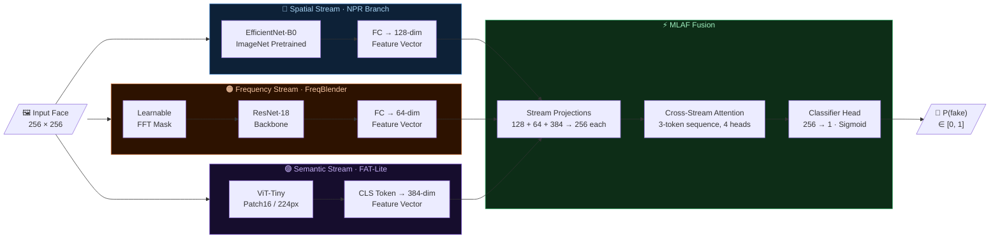

<div align="center">


<br/>


<br/><br/>

[](https://python.org)
[](https://pytorch.org)
[](https://developer.nvidia.com/cuda-toolkit)
[](https://huggingface.co)
[](LICENSE)

[]()
[]()
[-98.09%25-0969da?style=for-the-badge)]()
[]()
[]()

</div>

---

## How It Works — 3-Stream Architecture

<p align="center">
  
</p>

Each input face is processed simultaneously by three independent streams, each capturing a different class of forgery evidence:

<table>
<tr>
<td width="33%" align="center">
<h3>🔷 Spatial Stream</h3>
<b>EfficientNet-B0 → 128-dim</b><br/><br/>
Detects <b>pixel-level texture artifacts</b> and <b>boundary inconsistencies</b> — the visible seams and blending errors left by generative upsampling.
</td>
<td width="33%" align="center">
<h3>🟠 Frequency Stream</h3>
<b>ResNet-18 + Learnable FFT Mask → 64-dim</b><br/><br/>
Detects <b>spectral anomalies</b> and <b>periodic noise patterns</b> in the frequency domain — invisible to the eye but present in the Fourier spectrum of every generated image.
</td>
<td width="33%" align="center">
<h3>🟣 Semantic Stream</h3>
<b>ViT-Tiny (FAT-Lite) → 384-dim</b><br/><br/>
Detects <b>high-level structural inconsistencies</b> — unnatural face geometry, irregular landmark relationships, and global compositional errors.
</td>
</tr>
</table>

All three feature vectors are fused by a **Multi-Level Attention Fusion (MLAF)** module via cross-stream attention (3-token sequence, 4 heads, 256-dim projection), producing the final P(fake) score.

---

## Abstract

AI-generated face imagery (deepfakes) poses escalating threats to digital trust, media integrity, and identity security. Existing single-stream detectors trained on one generative model family consistently fail to generalize to novel, unseen generators — a critical limitation for real-world deployment where the threat landscape is constantly evolving.

We present **MS-DFD** (*Multi-Stream Deepfake Face Detector*), a unified framework that fuses three orthogonal views of forgery evidence through a **Multi-Level Attention Fusion (MLAF)** module. The cross-stream attention enables the model to weight each stream's contribution dynamically per sample, learning generator-agnostic forgery representations that transfer to unseen generators.

**Key result:** Our model achieves only **−1.91% generalization drop** on SDXL (never seen during training), versus **−10.24%** for a frequency-only baseline — a **5.3× improvement** in cross-generator robustness.

---

## Performance at a Glance

<div align="center">

| Metric | **MS-DFD (Ours)** | UnivFD (CVPR '23) | CNNDetect (CVPR '20) |
|:-------|:-----------------:|:-----------------:|:--------------------:|
| AUC-ROC | **99.92%** | 91.4% | 85.2% |
| Accuracy | **94.25%** | 86.7% | 79.8% |
| Recall | **99.82%** | 85.4% | 78.3% |
| F1 Score | **90.34%** | 84.3% | 77.1% |
| EER | **1.27%** | 9.1% | 15.2% |
| Cross-Gen AUC (SDXL) | **98.09%** | — | — |
| Generalization Drop | **−1.91%** | — | — |

*All models trained and evaluated on the same face dataset (stratified split, seed=42). No data leakage.*

</div>

---

## Architecture



<div align="center">

| Stream | Backbone | Output Dim | Forgery Cues Captured |
|:-------|:--------:|:----------:|:----------------------|
| **Spatial (NPR)** | EfficientNet-B0 | 128 | Pixel texture artifacts, blending boundaries |
| **Frequency (FreqBlender)** | ResNet-18 + Learnable FFT | 64 | Spectral anomalies, up-convolution artifacts |
| **Semantic (FAT-Lite)** | ViT-Tiny patch16 | 384 | Global structural inconsistencies, face geometry |
| **Fusion (MLAF)** | Cross-Stream Attention | 256 | Inter-stream relationships → final classification |

**Total Parameters:** 22.9M &nbsp;·&nbsp; **Optimizer:** AdamW (lr=3×10⁻⁴, cosine LR) &nbsp;·&nbsp; **Loss:** Weighted BCE (pos_weight=2.72)

</div>

---

## Results

### ROC Curve & Confusion Matrix

<p align="center">
  
  &nbsp;&nbsp;
  
</p>

<div align="center">

| | Metric | Value |
|--|:-------|------:|
| ✅ | AUC-ROC | **99.92%** |
| ✅ | False Negatives (missed fakes) | **1** / 553 |
| ⚠️ | False Positives (real flagged as fake) | 117 / ~1,500 |
| ✅ | Equal Error Rate | **1.27%** |

</div>

The model is intentionally conservative — in high-stakes detection tasks, missing a fake (FN) is costlier than a false alarm (FP). The single missed fake (FN=1) confirms near-perfect recall at 99.82%.

### Prediction Score Distribution

<p align="center">
  
</p>

Score distributions are sharply bimodal with minimal overlap. Fakes cluster near **1.0**, real images near **0.0** — high decision confidence with minimal ambiguous predictions near the 0.5 threshold.

### Baseline Comparison

<p align="center">
  
</p>

---

## Cross-Generator Generalization

> **Experiment:** Train on **Stable Diffusion v1.x** face images exclusively → evaluate on **SDXL** (architecturally different, never seen during training). This stress-tests generalization to a novel, more capable generator family.

<p align="center">
  
</p>

<div align="center">

| Ablation Configuration | In-Dist AUC | SDXL AUC | Gen. Drop |
|:-----------------------|:-----------:|:--------:|:---------:|
| Frequency Only | 68.5% | 58.26% | −10.24% |
| Spatial + Frequency | 100% | 95.98% | −4.02% |
| Spatial Only | 100% | 96.44% | −3.56% |
| Semantic Only | 100% | 97.17% | −2.83% |
| Spatial + Semantic | 100% | 93.64% | −6.36% |
| **Full 3-Stream (MS-DFD)** | **100%** | **98.09%** | **−1.91% ✓** |

</div>

**Key finding:** Spatial + Semantic (−6.36%) performs *worse* than Spatial alone (−3.56%). When spatial and semantic streams provide conflicting signals on out-of-distribution SDXL images, accuracy degrades. The **frequency stream acts as a tie-breaker** — its spectral view resolves inter-stream conflicts and enables the full model to achieve the lowest generalization drop of any configuration.

---

## GradCAM++ Interpretability

Gradient-weighted class activation maps reveal which spatial regions the model uses as evidence. All samples below: `true_label=fake, predicted=fake, confidence=100%`.

<p align="center">
  
  
  
  
  
  
</p>

Hot regions (red/yellow) consistently localize to **facial boundaries**, **periocular regions**, and **skin texture transitions** — precisely where diffusion model up-convolution artifacts are theoretically expected to appear. This provides interpretable, physically motivated evidence that the model has learned genuine forgery semantics rather than spurious correlations.

---

## Dataset

### Composition

<div align="center">

| Source | Category | Count | Notes |
|:-------|:--------:|------:|:------|
| FFHQ 256px | Real | ~15,000 | High-quality aligned faces |
| CelebA-HQ | Real | ~3,000 | Celebrity faces, diverse conditions |
| DiffusionDB (face-filtered) | Fake | 5,524 | SD v1.x; OpenCV face detector applied |
| 8clabs/sdxl-faces | Fake (eval only) | 1,920 | SDXL; zero overlap with training |

</div>

### Train / Val / Test Splits

<div align="center">

| Split | Real | Fake | Total | Purpose |
|:------|-----:|-----:|------:|:--------|
| Train | ~12,000 | ~4,419 | ~16,419 | Supervised training |
| Validation | ~1,500 | ~552 | ~2,052 | Early stopping on AUC |
| Test | ~1,500 | ~553 | ~2,053 | Final reported metrics |
| Cross-Gen (SDXL) | 1,500 | 1,920 | 3,420 | Generalization evaluation |

</div>

> Stratified per-class split, single RNG seed=42. Zero data leakage across splits — verified by single-pass indexing before any split assignment.

---

## Quick Start

### Requirements

```
Python    3.10+
CUDA      12.8
GPU       8 GB+ VRAM  (tested: RTX 5060 Ti 16GB)
Storage   ~5 GB for datasets
```

### Installation

```bash
git clone https://github.com/noushad999/thesis_grp_3.git
cd thesis_grp_3

# Pinned versions — exact reproducibility guaranteed
pip install -r requirements-lock.txt
```

### Data Setup

```bash
export DATA_ROOT=/path/to/data   # or edit configs/config.yaml directly

# Step 1: Download datasets
python scripts/download_datasets.py

# Step 2: Filter DiffusionDB → face images only (OpenCV detector)
python scripts/filter_faces.py \
  --input  $DATA_ROOT/fake/diffusiondb \
  --output $DATA_ROOT/fake/diffusiondb_faces

# Step 3: Organize
#   faces_dataset/real/{ffhq, celebahq}
#   faces_dataset/fake/diffusiondb_faces
```

### Train

```bash
python scripts/train.py \
  --config   configs/config.yaml \
  --data-dir $DATA_ROOT/faces_dataset

# Saves best checkpoint → checkpoints/best_model.pth  (epoch 15)
# Early stopping patience = 8 epochs on validation AUC
```

### Evaluate

```bash
# Full evaluation + GradCAM++ heatmaps
python scripts/evaluate.py \
  --config       configs/config.yaml \
  --checkpoint   checkpoints/best_model.pth \
  --data-dir     $DATA_ROOT/faces_dataset \
  --output-dir   logs/eval \
  --num-heatmaps 20

# Baseline comparison (CNNDetect, UnivFD)
python scripts/compare_baselines.py \
  --config   configs/config.yaml \
  --data-dir $DATA_ROOT/faces_dataset

# Cross-generator evaluation (SDXL)
python scripts/cross_generator_eval.py \
  --config         configs/config.yaml \
  --checkpoint     checkpoints/best_model.pth \
  --real-dir       $DATA_ROOT/real \
  --fake-dir       $DATA_ROOT/fake/sdxl_faces/imgs \
  --generator-name SDXL \
  --max-images     1500

# Ablation study — trains all 5 configurations
bash scripts/run_ablations_clean.sh
bash scripts/cross_gen_ablation.sh
```

### Single-Image Inference

```bash
python scripts/inference.py \
  --checkpoint checkpoints/best_model.pth \
  --image      path/to/face.jpg

# Output: P(fake) score ∈ [0, 1]  |  threshold = 0.5
```

---

## Project Structure

<details>
<summary><strong>Expand full directory tree</strong></summary>

```
deepfake-detection/
│
├── assets/
│   ├── streams.svg                   # ← Animated 3-stream pipeline diagram
│   ├── figures/                      # ROC curve, confusion matrix, ablation charts
│   └── heatmaps/                     # GradCAM++ visualizations (heatmap_01–06.jpg)
│
├── configs/
│   └── config.yaml                   # All hyperparameters — DATA_ROOT portable
│
├── data/
│   └── dataset.py                    # DeepfakeDataset — stratified split, augmentation
│
├── models/
│   ├── spatial_stream.py             # NPRBranch — EfficientNet-B0 → 128-dim
│   ├── freq_stream.py                # FreqBlender — ResNet-18 + LearnableFFTMask → 64-dim
│   ├── semantic_stream.py            # FATLiteTransformer — ViT-Tiny → 384-dim
│   ├── fusion.py                     # MLAFFusion — 3-token cross-stream attention
│   ├── full_model.py                 # MultiStreamDeepfakeDetector + ablation modes
│   ├── baselines.py                  # CNNDetect + UnivFD baselines
│   └── localization.py               # GradCAM++ heatmap generation
│
├── scripts/
│   ├── train.py                      # AdamW, cosine LR, early stopping on AUC
│   ├── evaluate.py                   # Evaluation + GradCAM++ heatmaps
│   ├── compare_baselines.py          # Side-by-side vs CNNDetect / UnivFD
│   ├── cross_generator_eval.py       # Cross-generator AUC (SDXL, unseen generators)
│   ├── filter_faces.py               # OpenCV face detector for DiffusionDB filtering
│   ├── inference.py                  # Single-image prediction
│   ├── robustness_eval.py            # Robustness under JPEG compression, blur, noise
│   ├── run_ablations_clean.sh        # All 5 ablation training configurations
│   └── cross_gen_ablation.sh         # Cross-generator ablation table
│
├── reports/                          # 10 detailed technical reports
├── requirements.txt
└── requirements-lock.txt             # Pinned — CUDA 12.8, PyTorch 2.9.1
```

</details>

---

## Engineering Notes

<details>
<summary><strong>Critical bug fixes applied</strong></summary>

<br/>

| File | Fix Applied | Impact |
|:-----|:------------|:-------|
| `data/dataset.py:97` | `os.walk(followlinks=True)` | Symlinked dataset directories returned 0 images without this |
| `data/dataset.py:110` | Single-RNG stratified split | Original implementation had data leakage across train/val/test |
| `models/baselines.py:77` | `F.interpolate(x, (224,224))` in UnivFD | CLIP ViT-L/14 requires 224×224 — crashed at runtime on 256×256 input |
| `configs/config.yaml:51` | `pos_weight: 2.72` (was 1.25) | Corrected for actual 15k:5.5k real:fake class imbalance |
| `configs/config.yaml:7` | `${DATA_ROOT:-data}` (was absolute path) | Portable across all machines without manual config edits |
| `models/localization.py:79` | GradCAM++ alpha sum over `axis=(1,2)` | Per-pixel alpha computation was mathematically incorrect |
| `models/fusion.py:22` | 3-token sequence cross-stream attention | `seq_len=1` self-attention is a mathematical no-op (no cross-stream information flow) |

</details>

<details>
<summary><strong>Technical reports index (10 reports)</strong></summary>

<br/>

| # | Report | Primary Audience |
|:-:|:-------|:----------------:|
| 01 | Project Overview — complete summary of all work | General |
| 02 | Code Explained — line-by-line in plain language | Non-technical |
| 03 | Figures Explained — every chart interpreted | General |
| 04 | Architecture — full technical model specification | Technical |
| 05 | Defense Q&A — 15 thesis viva questions with answers | Student |
| 06 | Dataset & Pipeline — data collection and preprocessing | Technical |
| 07 | Experimental Results — all metrics and tables | Researcher |
| 08 | Baseline Comparison — detailed analysis vs CNNDetect/UnivFD | Researcher |
| 09 | Ablation Study — per-stream contribution analysis | Researcher |
| 10 | Publication Guide — ICCIT 2025 paper structure | Student |

</details>

---

## Reproducibility

All experiments are fully reproducible from a clean environment:

```bash
# Environment
Python 3.10   |   PyTorch 2.9.1   |   CUDA 12.8   |   RTX 5060 Ti 16GB

# Determinism
seed: 42
deterministic: true   # torch.backends.cudnn.deterministic = True

# Exact package versions
pip install -r requirements-lock.txt
```

Training configuration is fully declarative in `configs/config.yaml`. No hardcoded paths, no absolute references.

---

## Citation

If you use this work in your research, please cite:

```bibtex
@misc{ramim2025multistreamdeepfake,
  title   = {Multi-Stream Deepfake Detection via Spatial, Frequency,
             and Semantic Fusion with Cross-Generator Generalization},
  author  = {Ramim, Md Noushad Jahan and {Thesis Group 3}},
  year    = {2025},
  note    = {BSc Thesis — Multi-Stream Deepfake Face Detection},
  url     = {https://github.com/noushad999/thesis_grp_3}
}
```

---

## References

<details>
<summary><strong>Show all references</strong></summary>

<br/>

1. Wang, S. et al. *"CNN-generated images are surprisingly easy to spot — for now."* CVPR 2020.
2. Ojha, U. et al. *"Towards Universal Fake Image Detection by Exploiting CLIP's Potential."* CVPR 2023.
3. Qian, Y. et al. *"Thinking in Frequency: Face Forgery Detection by Mining Frequency-Aware Clues."* ECCV 2020.
4. Durall, R. et al. *"Watch Your Up-Convolution: CNN Based Generative Deep Neural Networks are Failing to Reproduce Spectral Distributions."* CVPR 2020.
5. Dosovitskiy, A. et al. *"An Image is Worth 16×16 Words: Transformers for Image Recognition at Scale."* ICLR 2021.
6. Rombach, R. et al. *"High-Resolution Image Synthesis with Latent Diffusion Models."* CVPR 2022.
7. Podell, D. et al. *"SDXL: Improving Latent Diffusion Models for High-Resolution Image Synthesis."* arXiv 2023.

</details>

---

<div align="center">


**Md Noushad Jahan Ramim** &nbsp;·&nbsp; BSc Thesis Group 3

*Built with PyTorch &nbsp;·&nbsp; CUDA 12.8 &nbsp;·&nbsp; RTX 5060 Ti 16GB*

<br/>

[](https://pytorch.org)
[](https://huggingface.co)
[](https://github.com/noushad999/thesis_grp_3)

</div>
